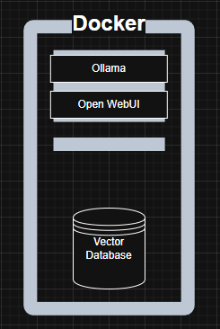

```
┌──────────────────────────────────────────────────────────────┐
│  Localizing Open-Source AI (LLMs) models using Ollama and    │
│  Open-WebUI running on Docker.                               │
└──────────────────────────────────────────────────────────────┘
```

# Hardware Requirements
- Setting up your AI model with Ollama+OpenWebUI on Docker requires certain hardware specification.
- Depending on size of AI models, processing needs, and specific workloads, the requirements will be varied.
- For detail hardware requirements, please read [hardware-requirement-guide](./Hardware-Requirement.md)

# Step 1: Running Docker on Window's WSL2
**Enable WSL2 and Install Ubuntu**
1. Open **PowerShell as Administrator** and enable WSL:
```
wsl --install
```
2. Restart your PC if prompted
3. Check available distros:
```
wsl -l -o
```
4. Install **Ubuntu**(if not installed)
```
wsl --install -d Ubuntu
```
5. Open **Ubuntu** from the Start Menu or PowerShell and update packages:
```
sudo apt update && sudo apt upgrade -y
```

**Install Docker on WSL2**
1. Unistall Old versions(If installed)
```
sudo apt remove docker docker-engine docker.io containerd runc
```
2. Install Docker Dependencies
```
sudo apt update
sudo apt install -y ca-certificate curl gnupg
```
3. Add Docker GPG Key
```
sudo install -m 0755 -d /etc/apt/keyrings
curl -fsSL https://download.docker.com/linux/ubuntu/gpg | sudo tee /etc/apt/keyrings/docker.asc > /dev/null
sudo chmod a+r /etc/apt/keyrings/docker.asc
```
4. Add Docker Repository
```
echo "deb [arch=$(dpkg --print-architecture) signed-by=/etc/apt/keyrings/docker.asc] https://download.docker.com/linux/ubuntu $(lsb_release -cs) stable" | sudo tee /etc/apt/sources.list.d/docker.list > /dev/null
```
5. Install Docker
```
sudo apt update
sudo apt install -y docker-ce docker-ce-cli containerd.io docker-buildx-plugin docker-compose-plugin
```
6. Start and Enable Docker
```
sudo service docker start
sudo systemctl enable docker
```
7. Allow Docker to Run Without `sudo`
```
sudo usermod -aG docker $USER
newgrp docker
```
8. Verify Docker Installation
```
docker --version
docker run hello-world
```

**Install NVIDIA Container ToolKit**
> Prerequisite: Ensure you have NVIDIA GPU drivers installed on Windows.

1. Setup Nvidia Container ToolKit Repository
```
distribution=$(. /etc/os-release;echo $ID$VERSION_ID) \
&& curl -s -L https://nvidia.github.io/libnvidia-container/gpgkey | sudo apt-key add - \
&& curl -s -L https://nvidia.github.io/libnvidia-container/$distribution/libnvidia-container.list | sudo tee /etc/apt/sources.list.d/nvidia-container-toolkit.list
```
2. Install NVIDIA Container ToolKit:
```
sudo apt update
sudo apt install -y nvidia-container-toolkit
```
3. Configure Docker to Use NVIDIA Runtime
```
sudo nvidia-ctk runtime configure --runtime=docker
sudo systemctl restart docker
```
4. Test NVIDIA with Docker
```
docker run --rm --gpus all nvidia/cuda:12.0-base nvidia-smi
```

**Verfiy the installations**
1. Check **Docker Service**:
```
systemctl status docker
```
if not running, start it manually:
```
sudo service docker start
```
2. Run **NVIDIA test container**:
```
docker run --rm --gpus all nvidia/cuda:12.0-base nvidia-smi
```
or
```
nvidia-smi
```
Expected Output
```
+-----------------------------------------------------------------------------+
| NVIDIA-SMI ...                                                              |
| GPU  Name        Persistence-M | Bus-Id        | Display Active |
+-----------------------------------------------------------------------------+
```

## Step 2: Configuring GPU resources in `docker-compose.yml`

**For NIVIDIA GPU (CUDA)**
> Depending on system's GPU(NVIDIA, AMD, or no GPU), may need to adjust the `docker-compose.yml`
```
services:
  ollama:
    image: ollama/ollama
    deploy:
      resources:
        reservations:
          devices:
            - driver: nvidia
              count: all 
              capabilities: [gpu]
```
> For multiple GPUs, change `count:all` to `count:1` or other value.

**For AMD GPUs(ROCm)**
> If system has AMD GPU, replace the NVIDIA-specific configuration with followingL
```
services:
  ollama:
    image: rocm/ollama
    devices:
      - /dev/kfd
      - /dev/dri
    group_add:
      - video
```
> Ensure that ROCm drivers are installed and properly configured on your system.

**Running without a GPU(CPU Mode)**
> If system does not have dedicated GPU, simply **remove** the `deploy` or `devices` section from config file. The definition should look like this:
```
services:
  ollama:
    image: ollama/ollama
```
> Running AI models on CPU may be significantly slower compared to GPU accleration, but it still better than nothing.

# Step 2: Deploying Ollama and Open WebUI on docker
1. Clone or copy the provided the `docker-compose` file
2. Ensure to have Docker Compose installed:
```
docker-compose --version
```
if not, install Docker Compose:
```
sudo apt install docker-compose -y
```
3. Build Docker Images(No Cache):
```
docker-compose build --no-cache
```
4. Start Containers:
```
docker-compose up -d
```

# Importing AI-models from Ollama.
> Ensure `Ollama` container is running. If not start the ollama container.
**Access the Ollama Container's Shell**
```
docker exec -it ollama /bin/bash
```
**Install AI Models Insider the Container**
```
ollama pull <model-name>
```
**Check available AI Models on [Ollama's Website](https://ollama.com/search)**

**Verify Installed Models**
>This will display all available models inside the Ollama container.
```
ollama list
```
**Run an AI Model**
>To test a model inside the Ollama container's terminal
```
ollama run <model-name>
```
> Exit from the model
```
/bye
```
**Exit the Container's Shell**
```
exit
```
> Now, Ollama will stay running in the background with the installed models.


# Setting up the web chat interface `Open-WebUI`
> - The interface is nearly identical to OpenAI's ChatGPT
> - Ensure `Open-WebUI` container is running.
1. Open, and set up the account for Open-WebUI in your browser using `http://localhost:3000/`
2. Select the installed model to start the chat.
3. Start chatting!

# Implementing RAG(Retrival Augmented Generation) in Open-WebUI
>- Open WebUI natively supports ChromaDB for vector storage, making it easy to integrate RAG.
**Install & Configure Open WebUI with ChromaDB**
>- ChromaDB is already configured and installed on docker.
**Adjust Open WebUI Knowledge Settings for Better Retrieval**
1. Go to: `Settings → Knowledge`
2. Modify:
    - Chunk Size: Set it to 512 tokens (or experiment with 256–1024 for optimal performance).
    - Chunk Overlap: 20–30% overlap to ensure context continuity.
    - Enable Document Indexing: This helps Open WebUI retrieve chunks efficiently.
**Add & Index Documents**
To populate the database:
1. Navigate to `Knowledge Base` in Open WebUI.
> Customize your own AI-Model to retrive particular documents.
2. Upload documents (TXT, PDF, Markdown).
3. Click Process & Index to embed them into ChromaDB.

# Manage Docker Containers with `manage_containers.sh`
To run the script:
1. Give the permission to execute.
```
chmod +x manage_containers.sh
```
2. Run the scrip with a feature
```
./manage_containers <feature>
```
**Read the detail usage of script in [Managing_tools_guide](Managing_tools.md)**

